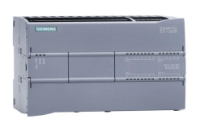
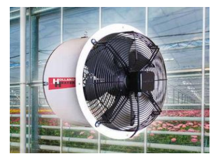
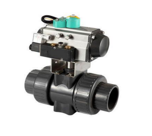
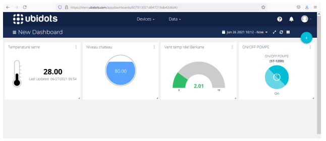

# Green-house-Iot-project

### Hardware Material

PLC S7-1200 
Ventilator 
Valve 
Temperature Sensor 
Level Sensor 
Humidity Sensor 

### TIA PORTAL
- Scale functions

- Pump

- Valve

- Ventilator

### Node-Red Dashboards
- Dashboard 1

- Dashboard 2

- Dashboard 3

### Ubidots Dashboard

